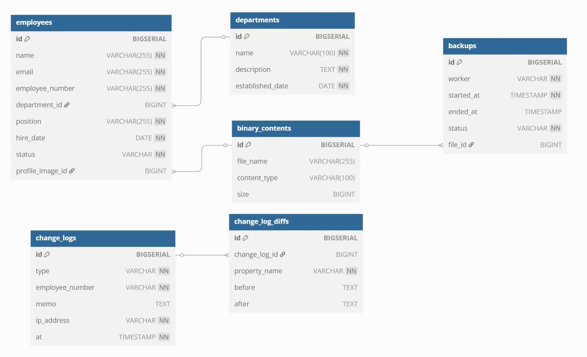
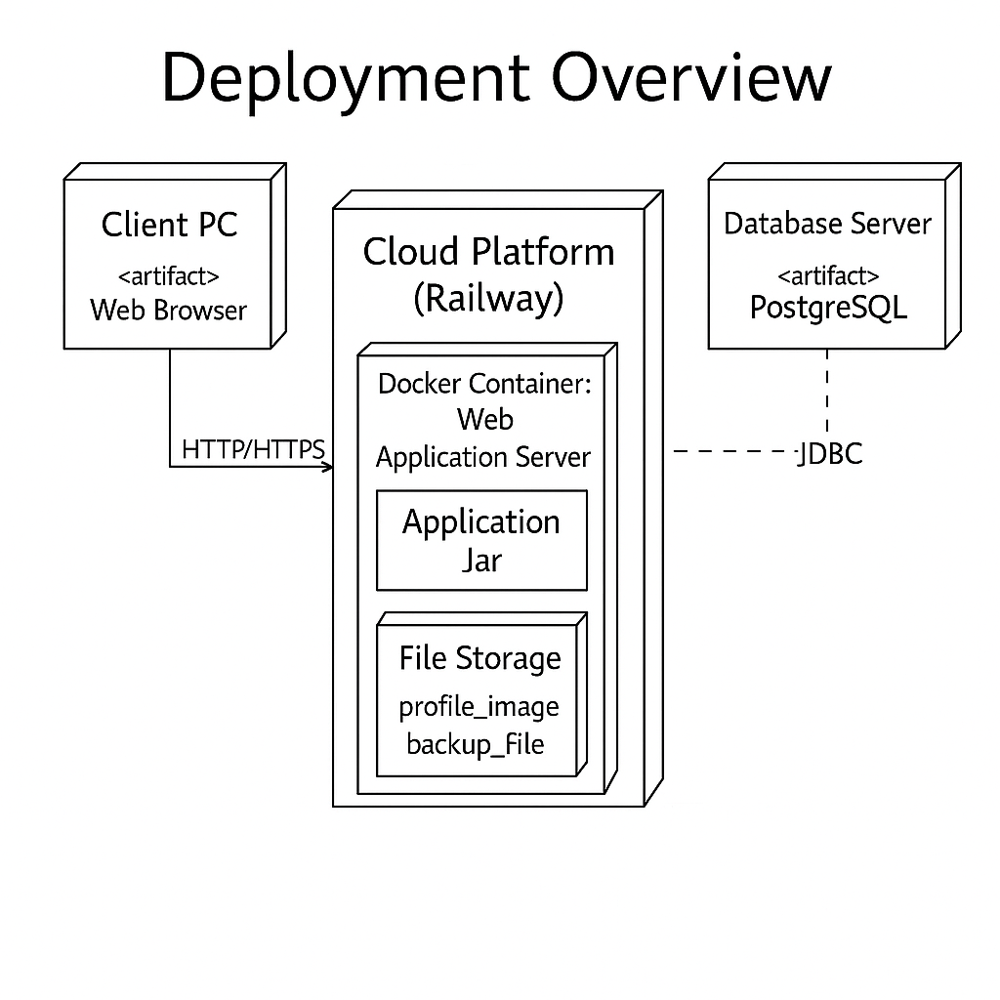
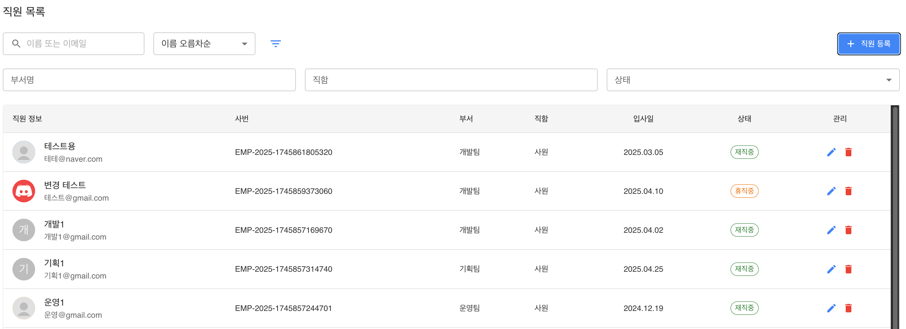
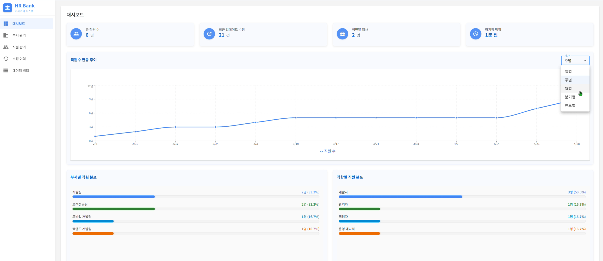

# 🏦 HR Bank - 인사관리 백엔드 시스템

> 프로젝트 계획서: [HR-Bank 계획서](https://www.notion.so/1dc6caf3785b80779f8dd1b59a0f73ca?pvs=4)

## 프로젝트 기간 : 2025.04.21 ~ 2025.04.29

## 📌 프로젝트 소개
- 기업의 인사 데이터를 효율적으로 관리하는 Spring 기반 백엔드 시스템

## 🏃‍♀️ 프로젝트 구성원과 R&R

| 팀원                                                                               | 주요 담당 |
|:---------------------------------------------------------------------------------|:---------|
| [허재석](https://github.com/JasonHeo1125)                                           | 직원 정보 관리 |
| [김민식](https://github.com/urur-27)                                                | 직원 정보 수정 이력 관리 |
| [김보경](https://github.com/BokyungKim-SPRING)                                      | 부서 관리 |
| [김태희](https://github.com/WaiCat)                                                 | 데이터 백업 관리(로직 담당) 개발 |
| [선혜린](https://github.com/seonseon933)                                            | 데이터 백업 관리(파일 담당) + 파일 관리 개발 |

### 🏫 주요 기능
- 부서 관리: 등록/수정/삭제/조회
- 직원 정보 관리: 등록/수정/삭제/조회
- 파일 관리: 프로필 이미지 업로드/다운로드
- 직원 수정 이력 관리: 변경사항 기록
- 데이터 백업 관리: 정기 백업, 백업 이력
- 대시보드 관리: 직원 수, 이력 건수, 월별 추이, 마지막 백업 시간, 직원 분포

### 🫙 ERD

### 🔧 배치 다이어그램

### 📁 파일 구조

📁 프로젝트 파일 구조

├── src 
│   └── main 
│       ├── java 
│       │   └── com 
│       │       └── hrbank 
│       │           ├── controller 
│       │           │   ├── api 
│       │           │   │   ├── DepartmentApi.java 
│       │           │   │   ├── EmployeeApi.java 
│       │           │   │   ├── EmployeeChangeLogApi.java 
│       │           │   │   ├── BackupApi.java 
│       │           │   │   └── BinaryContentApi.java 
│       │           │   ├── EmployeeController.java 
│       │           │   ├── DepartmentController.java 
│       │           │   ├── BackupController.java 
│       │           │   ├── EmployeeChangeLogController.java 
│       │           │   └── BinaryContentController.java 
│       │           ├── dto 
│       │           │   ├── department 
│       │           │   │   ├── DepartmentDto.java 
│       │           │   │   ├── DepartmentCreateRequest.java 
│       │           │   │   ├── DepartmentUpdateRequest.java 
│       │           │   │   └── CursorPageResponseDepartmentDto.java 
│       │           │   ├── employee 
│       │           │   │   ├── EmployeeDto.java 
│       │           │   │   ├── EmployeeCreateRequest.java 
│       │           │   │   ├── EmployeeUpdateRequest.java 
│       │           │   │   ├── EmployeeTrendDto.java 
│       │           │   │   ├── EmployeeDistributionDto.java 
│       │           │   │   ├── EmployeeSearchCondition.java 
│       │           │   │   └── CursorPageResponseEmployeeDto.java 
│       │           │   ├── employeeChangeLog 
│       │           │   │   ├── DiffDto.java 
│       │           │   │   ├── ChangeLogDto.java 
│       │           │   │   ├── CursorPageResponseChangeLogDto.java 
│       │           │   │   └── EmployeeChangeLogSearchRequest.java 
│       │           │   ├── backup 
│       │           │   │   ├── BackupDto.java 
│       │           │   │   └── CursorPageResponseBackupDto.java 
│       │           │   ├── binarycontent 
│       │           │   │   ├── BinaryContentCreateRequest.java 
│       │           │   │   └── BinaryContentDto.java 
│       │           │   └── error 
│       │           │       └── ErrorResponse.java 
│       │           ├── entity 
│       │           │   ├── Department.java 
│       │           │   ├── Employee.java 
│       │           │   ├── EmployeeChangeLog.java 
│       │           │   ├── EmployeeChangeLogDetail.java 
│       │           │   ├── Backup.java 
│       │           │   └── BinaryContent.java 
│       │           ├── enums 
│       │           │   ├── EmployeeStatus.java 
│       │           │   ├── EmployeeChangeLogType.java 
│       │           │   ├── BackupStatus.java 
│       │           │   └── EmployeeCsvHeader.java 
│       │           ├── exception 
│       │           │   ├── RestException.java 
│       │           │   ├── GlobalExceptionHandler.java 
│       │           │   └── ErrorCode.java 
│       │           ├── generator 
│       │           │   └── EmployeeCsvGenerator.java 
│       │           ├── mapper 
│       │           │   ├── DepartmentMapper.java 
│       │           │   ├── EmployeeMapper.java 
│       │           │   ├── EmployeeChangeLogMapper.java 
│       │           │   ├── BackupMapper.java 
│       │           │   └── BinaryContentMapper.java 
│       │           ├── repository 
│       │           │   ├── specification 
│       │           │   │   ├── DepartmentSpecifications.java 
│       │           │   │   └── EmployeeChangeLogSpecification.java 
│       │           │   ├── DepartmentRepository.java 
│       │           │   ├── EmployeeRepository.java 
│       │           │   ├── EmployeeRepositoryCustom.java 
│       │           │   ├── EmployeeRepositoryImpl.java 
│       │           │   ├── EmployeeChangeLogRepository.java 
│       │           │   ├── BackupRepository.java 
│       │           │   └── BinaryContentRepository.java 
│       │           ├── scheduler 
│       │           │   └── BackupScheduler.java 
│       │           ├── service 
│       │           │   ├── basic 
│       │           │   │   ├── BasicDepartmentService.java 
│       │           │   │   ├── BasicEmployeeService.java 
│       │           │   │   ├── BasicEmployeeChangeLogService.java 
│       │           │   │   ├── BasicBackupService.java 
│       │           │   │   └── BasicBinaryContentService.java 
│       │           │   ├── DepartmentService.java 
│       │           │   ├── EmployeeService.java 
│       │           │   ├── EmployeeChangeLogService.java 
│       │           │   ├── BackupService.java 
│       │           │   └── BinaryContentService.java 
│       │           └── storage 
│       │               └── BinaryContentStorage.java 
│       └── resources 
│           ├── static 
│           │   └── assets 
│           │   │   └── images 
│           │   │   │   └── default-profile.svg 
│           │   │   └── index-BwhjXOFb.js 
│           │   └── favicon.ico 
│           │   └── index.html 
│           └── application.yml 
└── test 
│   └── java 
│       └── com 
│           └── hrbank 
│               └── Sb02HrbankTeam5ApplicationTests.java 
├── build.gradle 
├── .gitignore 
├── settings.gradle 
├── README.md 

## 🛠️ 기술 스택
### Backend

### Database

### Version Control

### Communication

## 🖥️ 구현 홈페이지 및 각 기능별 화면
[[배포-HrBank 링크]](https://sb02-hrbank-team5-production-79ed.up.railway.app/)

### 부서

부서

### 직원

직원

- 직원을 등록/수정/삭제/조회 할 수 있습니다.
- 직원을 이름, 이메일, 부서명, 상태를 부분 일치로 검색할 수 있으며, 여러 조건을 조합해도 만족되는 결과만 출력됩니다.
- 이름, 입사일, 사원번호를 기준으로 오름/내림차순 정렬할 수 있습니다.

### 직원 수정 이력

직원 수정 이력

    
- 직원을 생성/수정/삭제한 경우 그 이력에 대한 정보를 보여줍니다.
- 상세 정보 확인을 통해 어떤 항목이 변경되었는지 확인할 수 있으며, 다양한 조건을 통한 검색 및 정렬 기능을 제공하고 있습니다.

### 데이터 백업

데이터 백업

## 여기 안에 사진과 짧은 설명을 넣어주세요.

### 대시보드

대시보드

- 대시보드는 총 직원수, 최근 업데이트 수정건, 이번달 입사자 수, 마지막 백업 시간에 대한 정보를 보여준다.
- 또한, 일별/주별/월별/분기별/연도별 직원의 수 추이를 그래프로 보여주고, 부서별&직함별 직원 분포 정보를 보여준다.

## 📜 프로젝트 4L 회고록

### 🏃‍♀️ 허재석 4L 회고록

허재석

- **Liked**
    - 처음 해보는 코딩 팀 프로젝트였는데, 마줘가면서 협업하는 즐거움을 느꼈습니다.
    - Git 이나 살짝 만져보았는데 DB, SQL, 서버 배포까지 해볼 수 있어서 색달랐습니다.
- **Lacked**
    - Git, SQL, DB 설정에 대한 기본기가 부족해서, 팀장으로서 민폐가 될까 걱정했던 순간들이 많았습니다.
    - 코드 PR 올리기 전에 한번 더 체크를 해서 불필요한 PR 리퀘스트를 줄여야 할 것 같았습니다.
- **Learned**
    - Git, PostgreSQL, Spring Boot 기본기는 물론이고, 실제 서비스처럼 API 명세 작성 → 구현 → 배포 전체 과정을 몸소 경험했습니다.
    - 개발이 단순히 ‘코드만 작성하는 것’이 아니라, 배포, 운영, 문제해결까지 다 포함되는 과정이라는걸 깨달았습니다.
- **Longed for**
    - 앞으로는 프로젝트를 시작할 때 DB, API, 배포까지 전체 구조를 설계할 수 있는 실력을 가지고 싶습니다.
    - 팀원들과 협업할 때, 서로 코드와 환경을 더 잘 이해하고 맞춰갈 수 있는 개발자가 되고 싶습니다.

### 🏃 김민식 4L 회고록

김민식

- **Liked**
    - 각자 파트를 나누어 작업하니 작업 속도가 훨씬 빨라지는 것을 느낄 수 있어 좋았습니다.
    - 혼자 작업한다면 놓치기 쉬운 부분들을 팀원들과 함께 보완해 나갈 수 있어 좋았습니다.
- **Lacked**
    - 프로젝트를 설계하고 협업하는 과정이 처음이라, 역할 분배 및 협업 과정에 시간이 오래 걸려 아쉬웠습니다.
    - Git 관리에 미숙함이 있어 프로젝트 중간에 작업한 내용을 삭제하는 등의 실수가 발생했고, 이로 인해 불필요하게 많은 시간이 소모되어 아쉬웠습니다.
    - 팀원들의 코드를 리뷰할 때, 코드의 구현 방식이나 사용된 기술을 파악하는 데 오랜 시간이 소요되어 아쉬웠습니다. 이런 부분을 줄일 수 있으면 좋겠다는 생각이 들었습니다.
- **Learned**
    - 협업 시 미리 규칙을 정하고, 공통적으로 사용하는 부분들을 합의한 뒤 작업을 시작하면 좋겠다는 것을 느꼈습니다.
    - 프로젝트를 단순히 구현하는 것뿐만 아니라, 팀원들과 양식을 맞추고 최적화를 위해 협업하는 과정 자체가 더욱 큰 목표라는 생각이 들었습니다.
- **Longed for**
    - 이후 협업을 진행할 때는 프로젝트 제반 사항들을 빠르게 파악하고 진행할 수 있도록 노력하겠습니다.
    - 프로젝트 구현에 적합한 기술을 파악할 수 있는 능력을 기르고 싶습니다.
    - 요구사항을 제대로 파악하지 못해 다시 제작하는 경우가 많았는데, 앞으로는 API 명세를 통해 요구사항을 좀 더 집중해서 파악할 수 있도록 하겠습니다.

### 🏃‍♂️ 김보경 4L 회고록

김보경

- **Liked**
    - 디스코드 팀 채널을 통해 원활한 의사 소통이 이루어졌습니다.
    - 코드 리뷰 다들 꼼꼼하게 봐주고 좋았던 점, 개선할 점을 잘 적어주어서 좋았습니다.
- **Lacked**
    - 코드 리뷰에 오류가 없으면 승인 머지 하다 보니 다른 코드들과 논리적으로 맞지 않을 때도 있었습니다.
    - 배포 단계에서 어려움을 겪었습니다.
- **Learned**
    - 프로젝트 초기 단계 계획의 중요성을 배웠습니다.
    - 다른 팀원의 코드를 보며 생각하지 못 했던 부분까지 신경 써 주셔서 코드 개선에 도움이 많이 됐습니다.
- **Longed for**
    - 시간 관리에 더 신경 써서 배포까지 여유 있게 테스트 해 볼 수 있도록 신경 쓰겠습니다.
    - 팀 프로젝트지만 더 유기적이고 체계적으로 구현 해보고 싶습니다.

### ‍🏃‍️️ 김태희 4L 회고록

김태희

- **Liked**
    - 스펙(Specification) 기반으로 필터링과 페이지네이션을 서버(DB) 레벨에서 안정적으로 처리한 점이 좋았습니다.
    - LocalDateTime  → OffsetDateTime 변환 문제를 고민하고, DB 구조를 개선하여 시스템 일관성을 높인것이 좋았습니다.
    - 첫 팀 프로젝트 였는데 커뮤니케이션이 잘되서 불편함 없이 잘 해낸것 같습니다.
- **Lacked**
    - 초기에는 메모리(Stream) 필터링 방식으로 개발을 시작해, 대량 데이터에 대한 고려가 늦었던게 아쉬웠습니다.
    - 깃허브가 익숙하지 않다 보니 코드간의 충돌이 많았습니다.
    - 요구사항을 잘 못 이해해 코드를 다시짜는 일도있었습니다.
- **Learned**
    - 대량 데이터 필터링은 반드시 DB 레벨에서 처리해야 확장성과 성능을 보장할 수 있다는 것을 배웠습니다.
    - LocalDateTime과 OffsetDateTime을 혼용할 때 시간대(Timezone) 관리가 얼마나 중요한지 체감했습니다.
    - 요구사항 분석만으로도 코딩하는 시간을 줄일 수 있다는것을 배웠습니다.
    - 깃허브의 활용성이 얼마나 중요한지 느꼈습니다.
- **Longed for**
    - 프로젝트 규모가 커져도 견딜 수 있는 레이어드 아키텍처 정리
    - 정확한 요구사항 분석
    - 커뮤니케이션및 협업을 위한 툴 사용법 터득

### 🏃️ 선혜린 4L 회고록

선혜린

- **Liked**
    - 팀원들과의 협업이 원활했으며, 커뮤니케이션이 잘 이루어졌습니다.
    - 문제를 해결하는 데 있어 창의적인 접근 방식이 통했을 때 큰 만족감을 느꼈습니다.
- **Lacked**
    - 프로젝트 초기 계획 단계에서 세세하게 하지 못해 아쉬움이 있습니다.
    - 프로젝트 배포 단계에서 문제를 찾지 못하였습니다.
    - 초기 csv 파일 생성 때 어떻게 하면 SRP문제를 해결하면서, 코드를 짜며 시간이 부족하여 아쉬웠ㅅ브니다.
- **Learned**
    - 프로젝트의 관리 방법과 더 효율적인 협업 방식에 대해 배웠습니다.
    - 트랜잭션의 격리 수준, 전파 속성에 대해 자세히 공부할 수 있었으며 이를 활용하여 트랜잭션 문제를 해결하였습니다.
    - 임시 파일의  사용법과 CSVPrinter를 사용법에 대해 배우며 다양한 기술을 배웠습니다.
- **Longed for**
    - 프로젝트 초기 때 세세한 일정 관리와 초기 설정을 하고 싶습니다.
    - 코드 리뷰를 좀 더 효율적으로 할 수 있는 방법을 배우고 적용하고 싶습니다.
    - 배포 관리에 대해 세세하게 공부하고 싶습니다.

